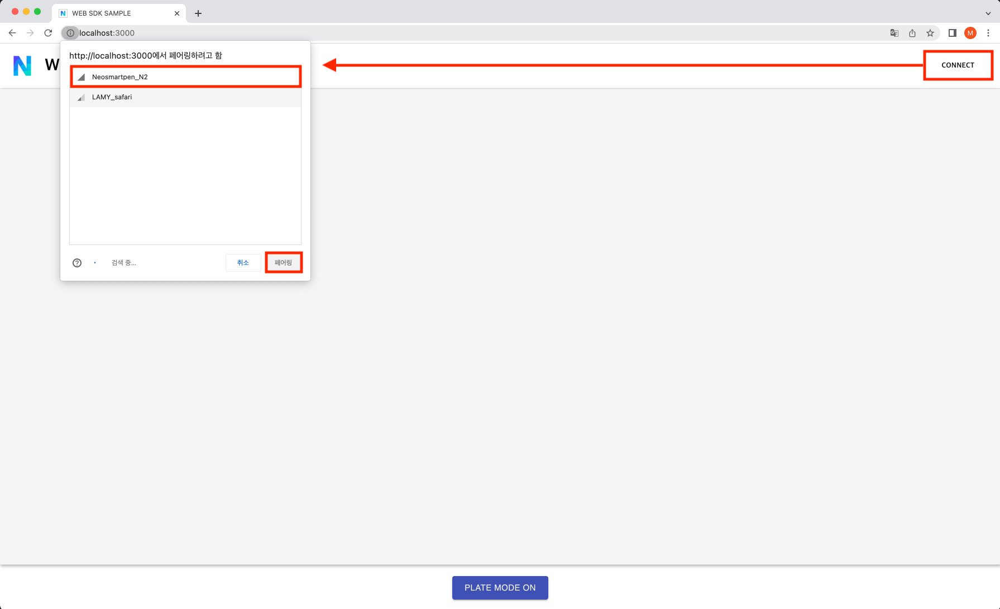
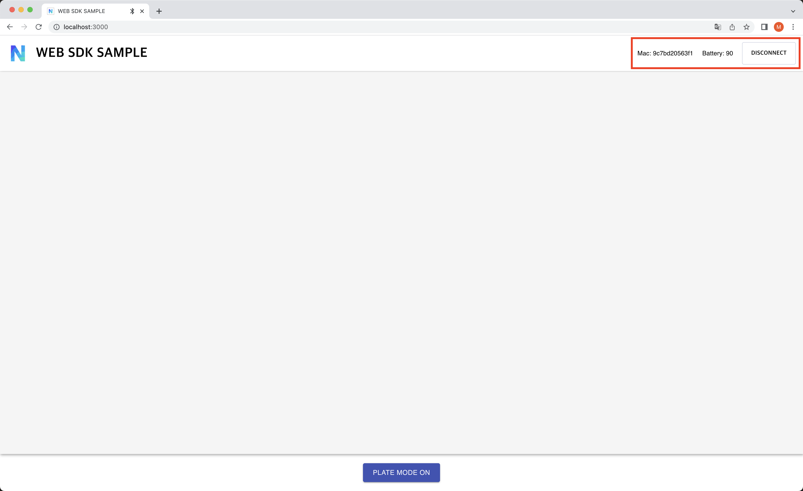
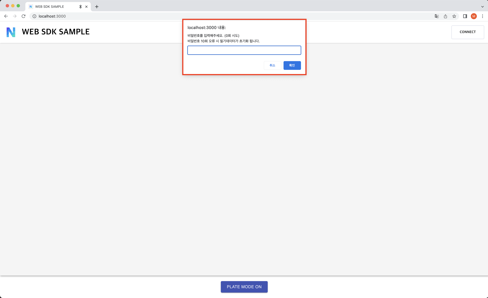
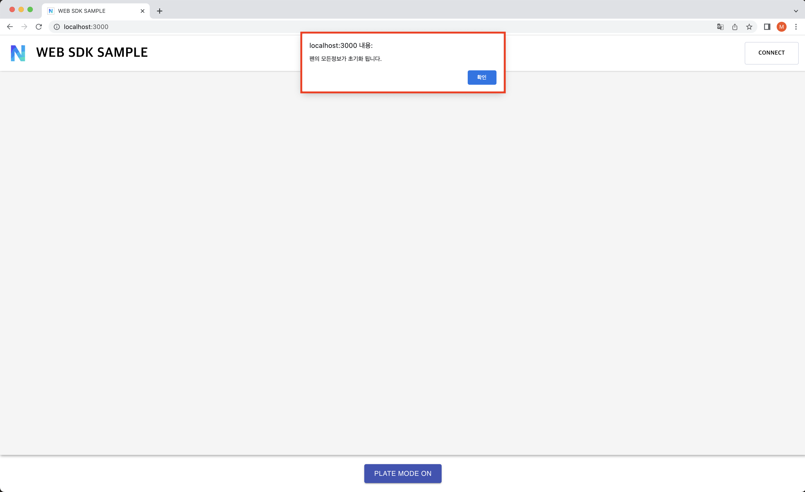
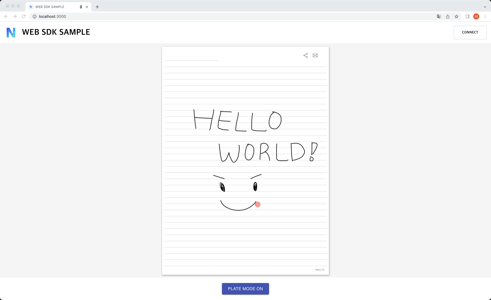
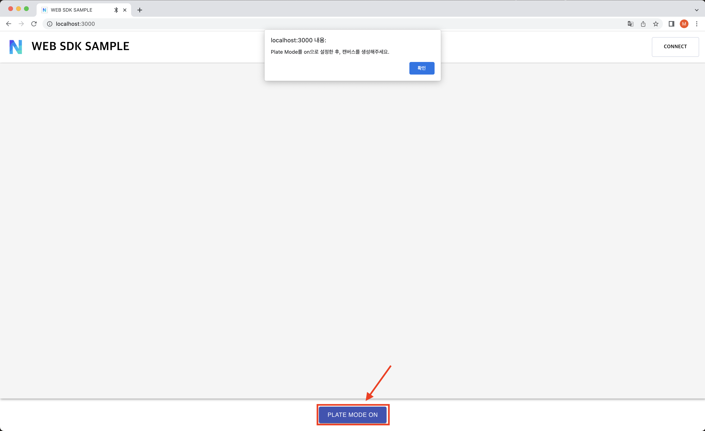
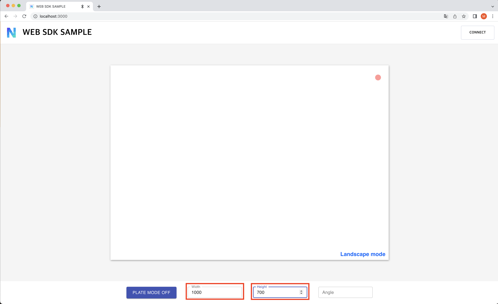
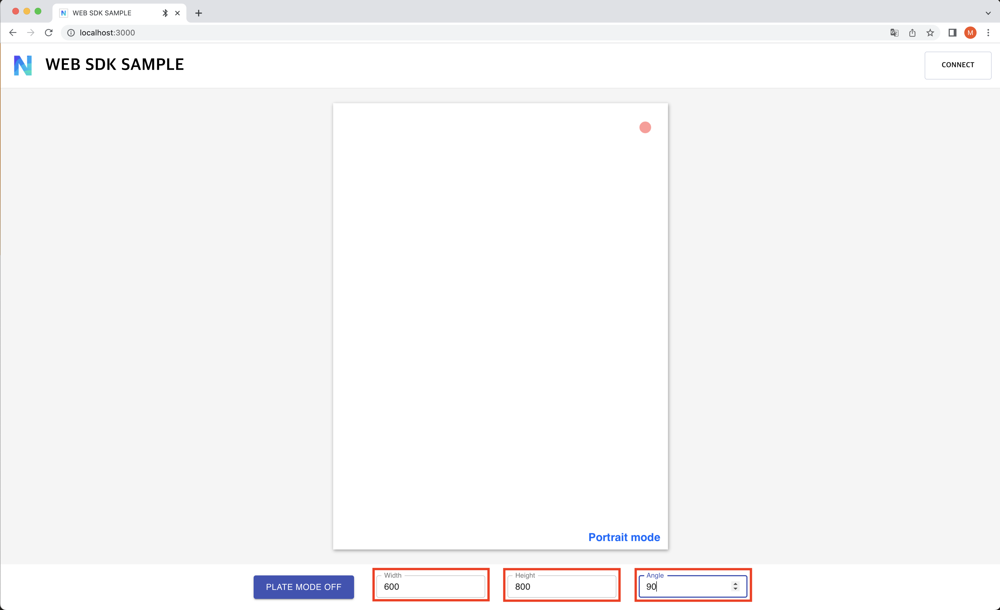

# Neo smartpen SDK Sample Page
Web SDK sample page using 'NeoSmart Pen'

## Installation 
``` sh
# Sample project setting
$ git clone https://github.com/MHCHOI3/web-sdk-sample2
$ cd web-sdk-sample2
$ npm install
$ npm start
```


## 🔨 Usage

### 1. Pen Connection


### 1-1. Successful Pen Connection


### 1-2. Required password if pen has a password set


### 1-3. 10 failed attempts at entering the password will reset the Pen


### 2. **(Paper)** Touch your ncode paper with a smartpen and wait until the note image pops up. Once the image is loaded, write anything.


### 3. **(SmartPlate)** If you want to write on the smart plate, click the 'PLATE MODE ON' button below. Then set the view size.


#### [Landscape]
- The default setting is landscape.



#### [Portrait]
- You can change the page orientation to portrait(vertical) by setting the angle value.



